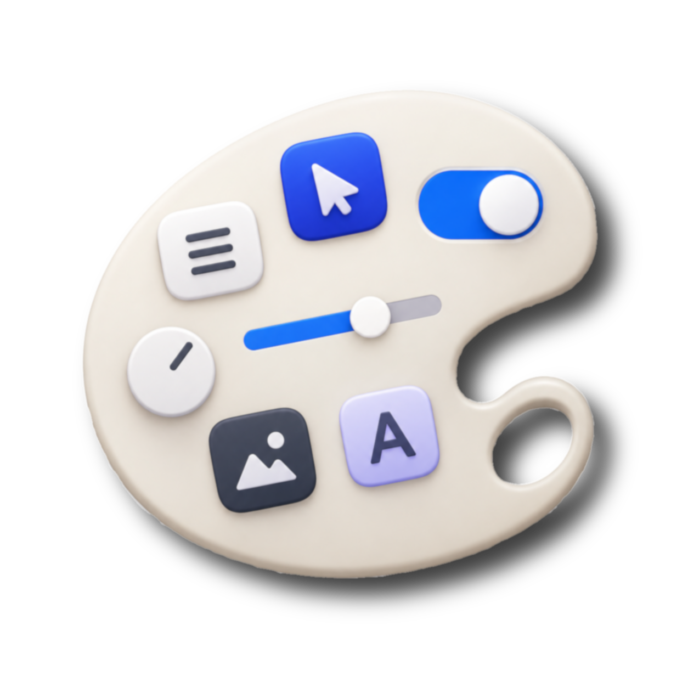

<p align="center">
  
</p>

<h1 align="center">Atelier</h1>

<p align="center">
  <strong>A modern, high-performance, GPU-accelerated C# UI framework for .NET 9</strong><br>
  <em>Powered by SkiaSharp, Silk.NET, and Material Design 3</em>
</p>

<p align="center">
  
  
  
  
  
</p>

---

## 🎨 Overview

**Atelier** is an open-source, hardware-accelerated UI framework built from the ground up for .NET 9. It replaces heavy, XML/XAML-centric desktop toolkits with a **clean, type-safe, declarative C# fluent API** and a **zero-allocation rendering pipeline** running on top of **SkiaSharp** and **OpenGL** via **Silk.NET**.

Atelier blends modern ergonomics with raw speed:
- **No XAML, No CSS, No WebViews**: Build your entire interface in pure C# with compile-time type safety, full IDE refactoring, and autocomplete.
- **Hardware Accelerated**: Every control is drawn directly to an OpenGL framebuffer via SkiaSharp using stack-allocated drawing contexts.
- **Material Design 3**: Fully realized Google Material 3 theming system with dynamic Light and Dark modes, comprehensive typography scales, and over 2,000+ vector Material Symbols.
- **Native AOT Compatible**: Designed with reflection-free paths to support Native AOT ahead-of-time compilation.

---

## ✨ Key Capabilities & Current Features

### 🖌️ Zero-Allocation GPU Rendering Pipeline
- **Immediate-Mode Drawing Context**: Stack-allocated `ref DrawingContext` passes drawing instructions directly to SkiaSharp with zero per-frame heap allocations.
- **Crisp Pixel Snapping**: Dedicated `DrawPixelRect` algorithms align borders, underlines, and carets to exact physical display pixels, completely eliminating fuzzy antialiasing blur on 1px lines.
- **Layer & Transform Scopes**: Scoped `PushClip`, `PushRoundedClip`, and `PushTransform` (`Matrix3x2`) helpers manage canvas states cleanly and safely via `IDisposable`.
- **Text Measurement & Caching**: High-performance font caching (`PaintRegistry`) and font metric calculation (`TextMeasurer`).

### 📱 Material Design 3 Theming System
- **Dynamic Color Palettes (`MaterialColorScheme`)**: Complete Material 3 token system (`Primary`, `Secondary`, `Tertiary`, `Surface`, `SurfaceContainer`, `Outline`, etc.) with instant Light Mode and Dark Mode switching.
- **Typography Scale (`MaterialTypography`)**: Full implementation of MD3 typography standards:
  - `DisplayLarge`, `DisplayMedium`, `DisplaySmall`
  - `HeadlineLarge`, `HeadlineMedium`, `HeadlineSmall`
  - `TitleLarge`, `TitleMedium`, `TitleSmall`
  - `BodyLarge`, `BodyMedium`, `BodySmall`
  - `LabelLarge`, `LabelMedium`, `LabelSmall`
- **Material Symbols (`MaterialIcon`)**: Over 2,000+ Google Material Symbols embedded directly via variable font format (`MaterialSymbolsRounded`), supporting font ligatures, arbitrary sizing, and runtime icon search.
- **Theme Decoupling**: Controls dynamically inherit theme changes across Light and Dark modes without losing local overrides or visual states.

### 🧩 Rich Control Suite
Atelier currently provides a comprehensive set of ready-to-use desktop controls:

| Control | Capabilities |
|---|---|
| **`TextBox`** | Outlined and Filled variants, animated floating label, leading icons, supporting text, selection highlighting, horizontal auto-scrolling with caret tracking, strict text clipping, double-click word selection, `Ctrl` / `Ctrl+Shift` word-by-word navigation, keyboard repeat, and clipboard shortcuts (`Ctrl+C`, `Ctrl+X`, `Ctrl+V`, `Ctrl+A`). |
| **`Button`** | Filled, Elevated, Tonal, Outlined, and Text variants with smooth hover, press, focus, and disabled visual states. |
| **`TextBlock`** | Multi-line text rendering, word wrapping, bold, italic, custom font families, and dynamic theme muted text handling. |
| **`Card`** | Elevated, Filled, and Outlined cards with configurable corner radii, clipping, and content nesting. |
| **`Slider`** | Continuous and discrete range selections with tick marks, keyboard arrow adjustment, and live value tooltips. |
| **`Switch`** | Material 3 toggle switch with animated thumb sliding and color morphing. |
| **`CheckBox`** | Three-state checkbox (Checked, Unchecked, Indeterminate) with vector checkmark rendering. |
| **`ComboBox`** | Dropdown selection control with smart-positioning popup list and search support. |
| **`Popup` & `PopupManager`** | Popover and overlay system with smart anchor placement, light-dismiss, and z-index ordering. |
| **`Dialog` & `DialogHost`** | Modal dialog system with dimmed backdrop scrim, open/close animations, and action buttons. |
| **`ScrollViewer`** | Smooth horizontal and vertical scrolling, automatic scrollbar visibility, and mouse-wheel support. |
| **`TreeView`** | Hierarchical expandable tree view with icons, expand/collapse toggles, and item selection. |
| **`ListBox` & `ItemsControl`** | Flexible collection presenter with item templates, single/multi selection models, and keyboard navigation. |
| **`PropertyGrid`** | Native AOT compatible, reflection-free object inspector with categorized and alphabetical sorting, real-time filtering, elevation toolbar, and built-in/custom editors for primitives, enums, and colors. |
| **`Image`** | SkiaSharp-backed bitmap and vector image rendering with multiple stretch modes (`Uniform`, `UniformToFill`, `Fill`, `None`). |
| **`Border` & `Panel`** | Versatile container controls for custom chrome, backgrounds, and layout composition. |

### 📐 Flexible Layout System
- **`Grid`**: Full WPF/CSS-style grid with `Star` (`*`), `Auto`, and fixed `Pixel` sizing, plus `RowSpan` and `ColSpan` support.
- **`StackPanel`**: Horizontal and Vertical stacked layouts with uniform spacing.
- **`Canvas`**: Absolute coordinate positioning.
- **`WrapPanel`**, **`DockPanel`**, and **`UniformGrid`**: Flow layouts, docking edges, and evenly divided grids.
- Complete support for `Margin`, `Padding`, `HorizontalAlignment`, `VerticalAlignment`, `MinWidth`, `MaxWidth`, `MinHeight`, `MaxHeight`, and geometric affine transforms.

### ⚡ Animation & Physics Engine
- **Spring Animations**: Physics-based sub-pixel spring models (`SpringAnimation`) for natural, fluid motion.
- **Tween Animations**: `FloatAnimation` and `ColorAnimation` with Material 3 easing curves (`EmphasizedDecelerate`, `EmphasizedAccelerate`, `Standard`).
- **High-Precision Clock**: Central `AnimationClock` synced with display refresh rates.

### 🖥️ Native Windowing & Platform Shell (`Atelier.Platform.Silk`)
- **Borderless Window Shell**: Modern borderless window styling on Windows with native DWM resize handles, drop shadows, and Aero snap.
- **Transparency & Opacity**: Hardware-accelerated transparent or translucent windows (`IsTransparent`, `WindowOpacity`).
- **Hot Reload**: Instant live reload (triggerable via F5 or Ctrl+R) that re-executes the UI factory while preserving ViewModel state.
- **Native Clipboard**: Seamless operating system clipboard integration (`SilkClipboard`).
- **Smooth Keyboard Repeat**: Native keyboard auto-repeat for navigation and editing keys.
- **Performance Diagnostics**: Built-in FPS and frame-time diagnostics overlay.

---

## 🚀 Quick Start

### 1. Simple Application Example

```csharp
using Atelier.Controls;
using Atelier.Core.Primitives;
using Atelier.Layout;
using Atelier.Markup;
using Atelier.Platform.Silk;
using Atelier.Theming;
using Atelier.Theming.Material;

internal static class Program
{
    private static void Main()
    {
        // 1. Set default Material theme
        ThemeManager.Current = MaterialTheme.CreateLight();

        // 2. Configure window
        var window = new SilkWindow(
            title: "My Atelier App",
            width: 800,
            height: 600,
            isTitleLess: true
        );

        // 3. Build UI with fluent declarative markup
        window.SetContent(() =>
            new StackPanel { Orientation = Orientation.Vertical, Spacing = 16 }
                .Padding(32)
                .Children(
                    new TextBlock("Welcome to Atelier")
                        .HeadlineMedium()
                        .Bold(),

                    new TextBlock("A modern GPU-accelerated UI framework for .NET 9.")
                        .BodyLarge()
                        .Muted(),

                    new TextBox
                    {
                        Label = "Your Name",
                        Placeholder = "Enter your name...",
                        LeadingIconKind = MaterialIconKind.Person,
                        Width = 320
                    },

                    new Button("Click Me", ButtonVariant.Filled)
                        .OnClick(btn => Console.WriteLine("Button clicked!"))
                )
        );

        // 4. Run the window loop
        window.Run();
    }
}
```

---

## 🏗️ Architecture & Project Structure

Atelier is modularized into distinct, decoupled assemblies:

| Project | Description |
|---|---|
| [`Atelier.Core`](file:///d:/GitHub/Atelier/src/Atelier.Core) | Visual tree, UIElement base, layout contracts, dependency/bindable properties, routed events, animations, and primitives. |
| [`Atelier.Rendering`](file:///d:/GitHub/Atelier/src/Atelier.Rendering) | SkiaSharp rendering backend, `DrawingContext` ref struct, `PaintRegistry`, and text measurement. |
| [`Atelier.Layout`](file:///d:/GitHub/Atelier/src/Atelier.Layout) | Layout panels: `Grid`, `StackPanel`, `Canvas`, `WrapPanel`, `DockPanel`, and `UniformGrid`. |
| [`Atelier.Theming`](file:///d:/GitHub/Atelier/src/Atelier.Theming) | Pluggable theming infrastructure, style managers, and control renderers. |
| [`Atelier.Theming.Material`](file:///d:/GitHub/Atelier/src/Atelier.Theming.Material) | Material Design 3 color schemes, typography, icon fonts, and Material control renderers. |
| [`Atelier.Controls`](file:///d:/GitHub/Atelier/src/Atelier.Controls) | Complete suite of desktop UI controls (TextBox, Button, Card, Slider, Switch, Dialog, PropertyGrid, etc.). |
| [`Atelier.Markup`](file:///d:/GitHub/Atelier/src/Atelier.Markup) | Fluent C# extensions for declarative layout composition, styling, and data binding. |
| [`Atelier.Platform.Silk`](file:///d:/GitHub/Atelier/src/Atelier.Platform.Silk) | Desktop windowing, OpenGL context creation, input events, and clipboard via Silk.NET. |
| [`Atelier.Gallery`](file:///d:/GitHub/Atelier/samples/Atelier.Gallery) | Comprehensive showcase application demonstrating all controls, themes, typography, and icons. |
| [`Atelier.Tests`](file:///d:/GitHub/Atelier/tests/Atelier.Tests) | Full automated unit and layout test suite (300+ tests). |

---

## 🏃 Running the Gallery Sample

To explore all the controls and features interactively, run the built-in Gallery application:

```bash
dotnet run --project samples/Atelier.Gallery
```

Features inside the gallery:
- **Buttons**: Showcase of all Material 3 variants (Filled, Elevated, Tonal, Outlined, Text).
- **TextBoxes**: Outlined, Filled, animated labels, leading icons, supporting text, and horizontal scrolling.
- **Typography**: Interactive playground testing font sizes, weights, and live theme color resolution.
- **Material Symbols**: Interactive search over 2,000+ vector icons with live filtering.
- **Cards & Layouts**: Elevation layers, clipping, nested grids, and stack layouts.
- **PropertyGrid**: Live inspector for complex objects with instant property updates.
- **Theme Switcher**: Instant toggle between Material 3 Light and Dark modes.

---

## 🧪 Running Tests

To run the full suite of automated unit tests:

```bash
dotnet test
```

---

## 📄 License

This project is licensed under the [MIT License](LICENSE).
Copyright (c) 2026 Markus Luedin.
